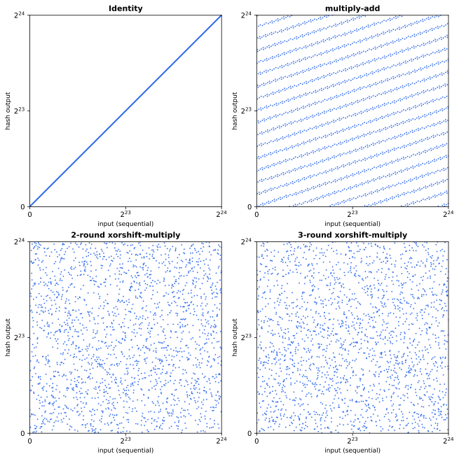
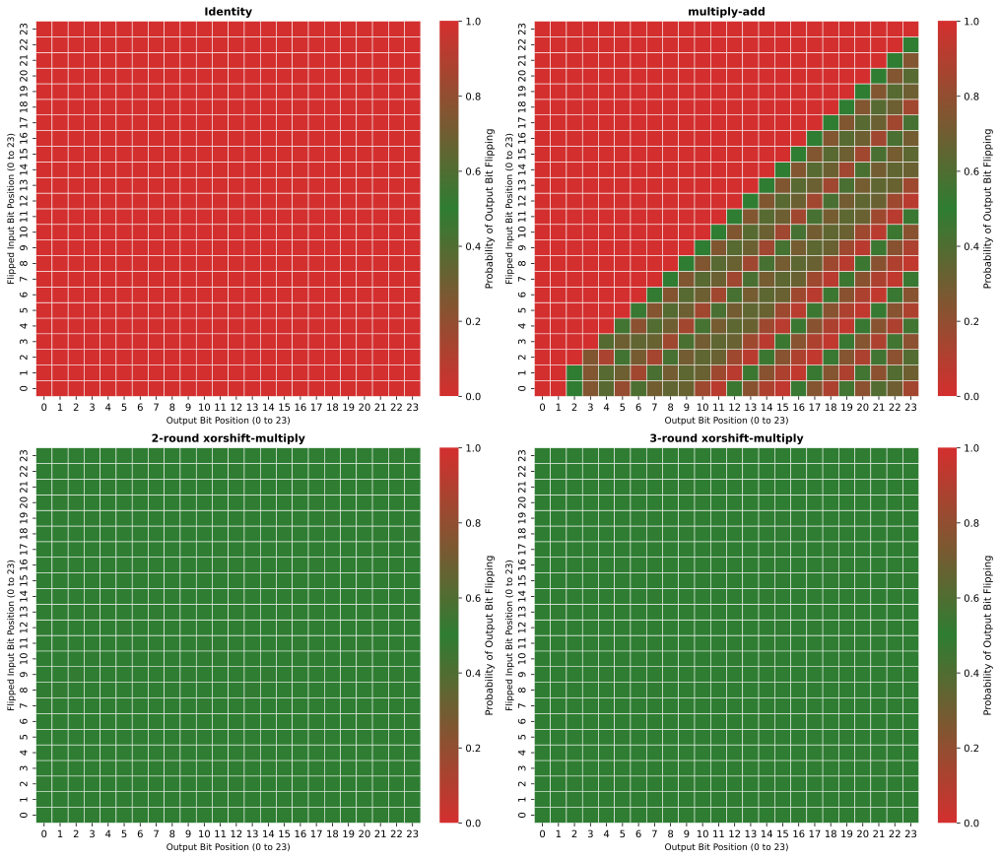

# Xorshift-Multiply-based integer hashes

This aims to explore the properties of an application of the xorshift-multiply integer hashes using the secrets from rapidhash.

## Repository structure

```
src/ # C++ source code for evalutating the hash functions
data/ # Results generated by C++ and JavaScript benchmark results
Makefile # Handy helpers
```

## Motivation

We were looking for a non-cryptographic hash function with minimal HashDoS reistance for V8. Due to the specifics of V8's string-to-integer optimizations, this needs to be:

1. A permutation on the 24-bit space
2. Efficiently invertible
3. Randomly keyed (i.e. some of the constants in the hash function should be seeded with a random number at program initialization to defend against HashDoS)
4. Provides good diffusion
5. Difficult to cause many collisions without seeing the random keys and the exact hash output

## Design

The search for bijective integer hash functions led us to Christopher Wellons' [hash-prospector](https://github.com/skeeto/hash-prospector) project, which generates billions of integer hash functions at random from a selection of nine reversible operations, then evaluates and ranks them. This project [showed](https://nullprogram.com/blog/2018/07/31/) that many of the best-performing functions came from the same family of constructions that use alternating rounds of xorshift and multiply, both invertible.

This family of xorshift-multiply constructions is used in many pseudorandom number generators/mixers like Java's [SplittableRandom](https://gee.cs.oswego.edu/dl/papers/oopsla14.pdf) and [MurmurHash3's finalizer](https://github.com/aappleby/smhasher/blob/92cf370/src/MurmurHash3.cpp#L68-L77). A great explanation of this construction can be found in [this article](https://www.pcg-random.org/posts/developing-a-seed_seq-alternative.html#multiplyxorshift) (and [this](https://ticki.github.io/blog/designing-a-good-non-cryptographic-hash-function/)): multiplication propagates information upward through its carry chain, while XOR-shift propagates information downward by folding high bits into low positions. These two operations are nonlinear with respect to the other's algebra, so alternating them breaks the patterns each one preserves.

Since our multipliers are random secrets, the interaction between the two operations differs for each set of secrets, and multiple rounds of alternation helps spreading the uncertainty across all bits.

A more detailed explanation of the development of our design can be found in [this Node.js blog post](TBD).

### Multiplier generation

For our specific use case, the existing rapidhash secrets that V8 already generates at startup was chosen for convenience and saved costs. While there is a width mismatch (rapidhash secrets are 64-bit), the secrets still retain some [desirable properties](https://chromium.googlesource.com/v8/v8/+/0a8b1cdcc8b243c62cf045fa8beb50600e11758a/third_party/rapidhash-v8/secret.h#50) after truncation. For example, each byte in the secrets must have exactly 4 bits set, and the generation ensures the secrets are odd, which is needed for the permutation to work. So we ended up just taking the lowest 24 bits of each rapidhash secret to derive the multipliers:

```cpp
const uint32_t kMask = (1 << 24) - 1;  // 24-bit mask
uint32_t derive_multiplier(uint64_t secret) {
  // The | 1 ensures the multiplier is odd, which is redundant in practice
  // but serves as a safeguard.
  return ((uint32_t)secret & kMask) | 1;
}
```

## Bias from SAC (Strict Avalanche Criterion)

During the development of the hash, we adapted the code in [hash-prospector](https://github.com/skeeto/hash-prospector/tree/master) to evaluate the bias (root-mean-square relative deviation) from the SAC for our 24-bit input space (scaled by 1000 for readability), and used it to guide the choices of the various constructions including this one.

| Construction | Bias |
|---|---:|
| identity | 1000.000 |
| xor only | 1000.000 |
| mul-add | 797.523 |
| xor-mul-xor | 795.189 |
| 1-round xorshift-multiply | 446.852 |
| 2-round xorshift-multiply | 3.447 |

We also ran the same analysis on multipliers derived from 50 sets of randomly generated rapidhash secrets, which revealed that the quality of the 2-round scheme can fluctuate quite a bit when the multipliers don't mix well, but another round of mixing improves the stability quite well:

| Rounds | Min | Mean | Max | Std Dev |
|---|---|---|---|---|
| **2 rounds** | 2.03 | 7.92 | 40.37 | 7.19 |
| **3 rounds** | 0.37 | 0.50 | 1.68 | 0.20 |

## Visualizations

For the seeded hashes, we derived the constants from the default rapidhash secrets for the visualization, but the variation analysis above should also help you extrapolate the variance in these visualizations when different secrets are applied.

First, we take sequential inputs (spaced by an interval for better visibility) and plot their hash outputs. This helps us easily spot any linear relationships or patterns.



Another way to visualize it is to look at the [avalanche matrix](https://cacm.acm.org/practice/questioning-the-criteria-for-evaluating-non-cryptographic-hash-functions/#F5). Here we take 50,000 random inputs, flip each input bit one at a time, and record how often each output bit changes. Each cell (row *i*, column *j*) shows the probability that flipping input bit *i* causes output bit *j* to flip - green means it's close to the ideal 50%, red means it's strongly biased toward never or always flipping. The more green there is, the better.



## Other evaluations

There are a few other evaluations included in this repository.

### LSB analysis

We exhaustively checked every distinct input pair in a 16-bit analogue of the hash against all valid key triples. The multipliers were constrained to match the rapidhash secret rules (each byte balanced with exactly 4 bits set, lowest byte odd). For each pair, we checked whether the low *k* bits of their outputs agreed for all key triples, with early exit on the first disagreement.

| LSB (k bits) | Pairs surviving all keys | Best survivor |
|---|---|---|
| 1 | 0 | 6,002,509 / 14.7B triples |
| 2 | 0 | 9,801 / 14.7B triples |
| 3 | 0 | 9,800 / 14.7B triples |
| 4 | 0 | 2,454 / 14.7B triples |

### BIC (Bit Independence Criterion) test

Adapted from SMHasher3's `BitIndependenceTest`. For each input bit flip, this test checks whether pairs of output bits change independently. Specifically, for every triple (input bit *j*, output bit *i*, output bit *k*), we build a 2x2 contingency table counting how many of the 2<sup>24</sup> inputs fall into each combination of "bit *i* changed" vs "bit *k* changed", then compute a chi-square statistic and convert it to Cramer's V (0 = perfectly independent, 1 = fully dependent).

Unlike SMHasher3, which uses sampled inputs and reports p-values with Bonferroni correction, we enumerate all 2<sup>24</sup> inputs exhaustively. With a complete census, every nonzero deviation from perfect independence is "statistically significant" - p-values become meaningless. Instead, we report Cramer's V as an effect-size measure: how *strong* is the dependence, not whether it's detectable.

| Rounds | Min V | Mean V | Max V | Std Dev |
|---|---|---|---|---|
| 2 rounds | 0.335 | 0.816 | 0.969 | 0.109 |
| 3 rounds | 0.009 | 0.037 | 0.198 | 0.038 |

### Seed Avalanche Test

Adapted from SMHasher3's `SeedAvalancheTest`. This tests whether flipping a single bit in the 64-bit meta seed that drives the generation of three rapidhash secrets, from which the 24-bit multipliers are derived - causes roughly 50% of output bits to change. Bias is reported on the same 0-1000 scale as the SAC test.

| Rounds | Min | Mean | Max | Std Dev |
|---|---|---|---|---|
| 2 rounds | 0.229 | 0.251 | 0.294 | 0.012 |
| 3 rounds | 0.233 | 0.244 | 0.252 | 0.004 |

## Reference

- [Hash Function Prospector](https://github.com/skeeto/hash-prospector)
- [rapidhash](https://github.com/Nicoshev/rapidhash) and [rapidhash-v8](https://chromium.googlesource.com/v8/v8/+/0a8b1cdcc8b243c62cf045fa8beb50600e11758a/third_party/rapidhash-v8/)
- [V8's Random Number Generator](https://chromium.googlesource.com/v8/v8/+/0596ead5b04f5988d7742c2a4559637a4f81b849/src/base/utils/random-number-generator.h)
- [Developing a seed_seq Alternative](https://www.pcg-random.org/posts/developing-a-seed_seq-alternative.html)
- [Designing a good non-cryptographic hash function](https://ticki.github.io/blog/designing-a-good-non-cryptographic-hash-function/)
